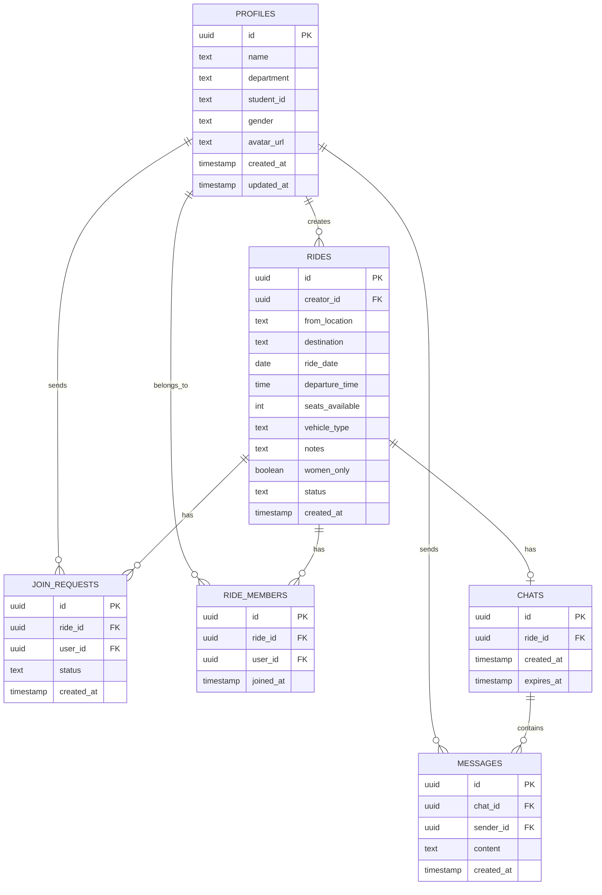

# BRACU RideShare - Implementation Plan

## Overview
A campus ride-sharing coordination platform for BRAC University students built with React Native Expo (TypeScript), Supabase, Expo Router, and NativeWind.

> [!IMPORTANT]
> This is NOT an Uber-like app. No drivers, payments, GPS tracking, or fare systems.

---

## Tech Stack
| Layer | Technology |
|-------|-----------|
| Frontend | React Native + Expo + TypeScript |
| Routing | Expo Router (file-based) |
| Styling | NativeWind (Tailwind CSS) |
| Backend | Supabase (Auth, DB, Realtime, Storage) |
| Database | PostgreSQL (via Supabase) |
| State | Zustand |

---

## Database Schema



---

## Development Phases

### Phase 1: Project Setup ✅
- [x] Expo + TypeScript + Expo Router
- [x] NativeWind configuration
- [x] Supabase client setup
- [x] Folder architecture
- [x] Environment variables
- [x] Bottom tab navigation skeleton

### Phase 2: Authentication ✅
- [x] Supabase Auth (email/password)
- [x] BRACU email validation (@g.bracu.ac.bd)
- [x] Sign up / Login / Logout
- [x] Persistent sessions
- [x] Auth state management (Zustand)

### Phase 3: User Profile ✅
- [x] Profile creation/edit screen
- [x] Avatar upload via Supabase Storage
- [x] Profile display

### Phase 4: Ride Creation & Feed ✅
- [x] Create ride form
- [x] Ride feed with cards
- [x] Search & filter
- [x] Ride detail view

### Phase 5: Join Request System ⬅️ CURRENT
- [ ] Request to join ride
- [ ] Creator accepts requests
- [ ] Auto-add to ride_members

### Phase 6: Realtime Group Chat ⬅️ NEXT
- [ ] Group chat room creation
- [ ] Realtime messages (Supabase Realtime)
- [ ] Push notifications (optional)
- Auto-create chat on first accept
- Realtime messaging via Supabase Realtime
- Chat expiry (1hr after departure)

### Phase 7: Women-Only Restrictions
- RLS policies for women-only rides
- Client-side filtering
- Gender-based access control

---

## Folder Architecture
```
app/
├── (auth)/
│   ├── login.tsx
│   └── signup.tsx
├── (tabs)/
│   ├── _layout.tsx
│   ├── index.tsx          (Home/Feed)
│   ├── create.tsx         (Create Ride)
│   ├── my-rides.tsx       (My Rides)
│   ├── chats.tsx          (Chats)
│   └── profile.tsx        (Profile)
├── ride/
│   └── [id].tsx           (Ride Details)
├── chat/
│   └── [id].tsx           (Chat Room)
├── _layout.tsx            (Root Layout)
components/
├── ui/                    (Reusable UI)
├── rides/                 (Ride components)
├── chat/                  (Chat components)
lib/
├── supabase.ts
├── types.ts
store/
├── authStore.ts
├── rideStore.ts
├── chatStore.ts
constants/
├── colors.ts
├── config.ts
```
